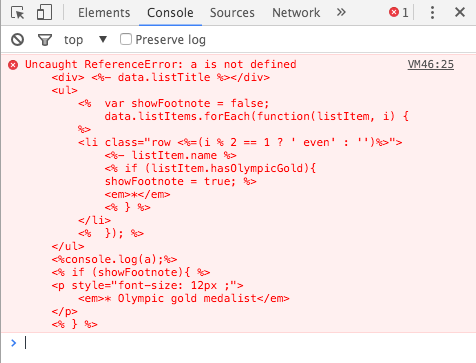

# Template

#Компиляция

Компиляция преобразует строку-шаблон в набор [IncrementalDOM](http://google.github.io/incremental-dom/#about) функций.

```ejs
<h1>Hello <%= data.name %>!</h1>
``` 

Результатом компиляции такой строки будет функция, выполняющая код аналогично следующей:

```javascript
var template = function(data) {
    elementOpen('h1');
    text('Hello ' + data.name);
    elementClose('h1');
};
```
> термин `аналогично` связан с тем что функции `elementOpen` `text` `elementClose` будут представлены в другом, укороченом, синтаксисе, определенном через замыкание. Так же возможны некоторые внутрение оптимизации синтаксиса, но функционально будет выполнена именно данная последовательность комманд.
> 
> Также обращаем Ваше внимание на то, что шаблон не обязательно должен иметь один родительский элемент

## Автоматическая и ручная компиляция шаболнов

Компиляция шаблона в `RAD` может происходить в автоматическом и ручном режиме.

### автоматический режим

В случае если вы устанавливаете значения свойства класса **View** `template` как строку, при инициализации экземпляра этого класса будет произведенна автоматическая компиляция в шаблонную функцию.

### ручная компиляция

Если вы хотите произвести компиляцию шаблона с кастомными параметрами или использовать уже заранее подготовленную шаблонную функцию, Вы можете так же присвоить ее в качестве значения свойству `template` необходимого класса.

> В этом случае, следует учитывать два момента:
> 
> - переданные во время компиляции опции остаються установленными и для последующих вызовов функции компиляции, поэтому в случае установки кастомных параметров не для всего проекта, после компиляции Вам необъодимо будет вернуть параметры по умолчанию
> - функция которая устанавливаеться в качестве значения параметра `template` должна манипулировать c элементами DOM'a с помощью функций [incremental-dom](). Если вам необходима другая функциональность смотрите [работа со стороними библиотеками]() и [кастомный рендеринг](). 

Для того чтобы скомпилировать шаблон в функцию необходимо воспользоваться методом [`RAD.template`](), например следующим образом:

```javascript
import template from 'RAD';

var templateFn = template(require('patch-to-template.ejs'));
```

В качестве второго параметра компиляции можно передавать  [опции компиляции]().

## RAD.template(templateString, [options])

Данная функция компилирует строку переданную первым параметром в шаблонную функцию c командами [incremental-dom]() 

```javascript
var container = document.getElementById('container');
var template = RAD.template('<h1>Hello <%= data.name %>!</h1>');

RAD.utils.IncrementalDOM.patch(container, template, {name: 'John'});
```

> Обратите внимание на то как применяеться шаблонная функция, на самом деле в большинстве случаев Вам [нет необходимости применять шаблоны в ручную](#). Но Вы всегда можете использовать как и прямую ссылку на `IncrementalDOM` если добавите библиотеку в проект, так уже внедренную `RAD.utils.IncrementalDOM`, разницы нет.

## options

Вторым параметром идидет объект в атрибутах которого устнановлены опции компиляции:


> Обратите внимание, что переданные во время компиляции опции остаються установленными и для последующих вызовов функции компиляции, поэтому в случае установки кастомных параметров не для всего проекта, после компиляции Вам необъодимо будет вернуть параметры по умолчанию

-

#### <u>options.template (Object):</u>
Задает синтаксис шаблонов.

**Type:** Парсинг шаблонов.

**Default:**

```
{
	evaluate: /<%([\s\S]+?)%>/g,
	interpolate: /<%=([\s\S]+?)%>/g,
	escape: /<%-([\s\S]+?)%>/g
}
```
**Description:**
По умолчанию шаблоны используют ERB-синтаксис такой же как и [underscore.template](http://underscorejs.org/#template). Параметр template позволяет задавать свои символы для выражений (аналогично `_.templateSettings` в underscore).

-

#### <u>options.order (String Array):</u>
Определяет порядок компиляции.

**Type:** Парсинг шаблонов.

**Default:**

```
['interpolate', 'escape', 'evaluate']
```
**Description:**
Определяет порядок применения регулярных вырожений из `options.template`, для случая если вы захотите пререопределить используемые шаблоны.

-

#### <u>options.evaluate (Object):</u>
Определяет синтаксис внедренного javascript кода.

**Type:** Парсинг шаблонов.

**Default:**

```
{
    name: 'script',
    open: '<script>',
    close: '</script>'
}
```
**Description:**
Определяет синтаксис служебного тег для промежуточного преобразования во время компиляции в который преобразовуеться javascript код в ваших шаблонах, расположеный внутри <i>evaluate</i> regular expression. Вы можете использовать данные теги вместо evaluate expressions.

-

#### <u>options.accessory (Object):</u>
Определяет синтаксис внедряемого в атребуты javascript кода.

**Type:** Парсинг шаблонов.

**Default:**

```
{
    open: ''
}
```
**Description:**
Служебные префикс и суффикс указывающие на начало и конец вычисляемого значения в шаблоне, и используемые для промежуточного преобразования во время компиляции в который преобразовуеться выражения *interpolate* и *escape* из шаблона. Так же как и служебный тег настроенный в *evaluate*, вы можете использовать их на прямую. 
        
        
>***Следует учитывать что служебные теги и префиксы имеют ограничения на синтаксис и разрешенные знаки, поэтому их прямое переопределение крайне не рекомендуеться - используйте настройки `template` для изменения синтаксиса шаблонов***

-

#### <u>options.emptyString (Boolean):</u>
Определяет синтаксис внедренного javascript кода.

**Type:** Парсинг шаблонов.

**Default:**

```
true
```
**Description:**
Опция которая указывает как будет отображен `undefined` в данных при рендеренге шаблонов. Если выставлено `true`, то вместо `undefined` будет отображена пустая строка.

-

#### <u>options.skipAttr (String):</u>
Определяет название атрибута.

**Type:** Парсинг шаблонов.

**Default:**

```
'skip'
```
**Description:**
Имя атрибута для команды incremental-dom пропускать или не пропускать DOM структуру данного элемента при выполнении шаблонной функции.

-

#### <u>options.staticKey (String):</u>
Определяет название атрибута.

**Type:** Парсинг шаблонов.

**Default:**

```
'key'
```
**Description:**
Имя атрибута для назначения [индивидуального ключа](http://google.github.io/incremental-dom/#demos/using-keys") конкретному элементу шаблона.

-

#### <u>options.staticArray (String):</u>
Определяет название атрибута.

**Type:** Парсинг шаблонов.

**Default:**

```
'static-array'
```
**Description:**
Имя атрибута для назначения [имени массиву статических атрибутов элемента]("http://google.github.io/incremental-dom/#rendering-dom/statics-array").

>Обратите внимание что в случае использования одного и того же имени массива в разных элементах **одного шаблона** - массив будет одним и тем же. И он будет сформирован из всех атрибутов первого элемента в котором будет использованно данное имя.
>
>В случае если в последующих элементах будет атрибуты будут иметь отличное значение от уже помещенного в массив, атрибут автоматически удаляеться из массива, но в пердидущие элементы не будет возвращен. Поэтому после определения массива статических атрибутов с помощью первого элемента, в последующих элементах просто используйте имя массива без всяких атрибутов.

-

#### <u>options.nonStaticAttributes (String Array):</u>
Определяет перечень атрибутов.

**Type:** Парсинг шаблонов.

**Default:**

```
['id', 'name']
```
**Description:**
Список атрибутов элемента которые никогда не будут помещены в массив статических аттрибутов. 

-

#### <u>options.textSaveTags (String Array):</u>
Определяет перечень html тегов.

**Type:** Парсинг шаблонов.

**Default:**

```
['pre', 'code']
```
**Description:**
Имена тегов в которых не удаляються пробелы и переносы строк. 

-

#### <u>options.voidRequireTags (String Array):</u>
Определяет перечень html тегов.

**Type:** Парсинг шаблонов.

**Default:**

```
['input', 'area', 'base', 'br', 'col', 'command', 'embed', 'hr', 'img', 'keygen', 'link', 'meta', 'param', 'source', 'track', 'wbr']
```
**Description:**
Самозакрывающиеся теги, которые будут представлены [void]("http://google.github.io/incremental-dom/#api/elementVoid")  коммандой.

-

#### <u>options.debug (Boolean):</u>
Переключает режим компиляции шаблона.

**Type:** Парсинг шаблонов.

**Default:**

```
false
```
**Description:**
Опция развернутой компиляции шаблона, если установлена в **true** то шаблон компилируется в развернутом виде(более читабельном), который можно вывести через `console.log(templateFn.toString());` и посмотреть на валидность синтаксиса.

И кроме того, шаблонная функция автоматически оборачиваться в `try/catch` которая позволяте отображать тип ошибки и шаблон в котором произошла ошибка:



-

#### <u>options.parameterName (String):</u>
Определяет имя объекта данных в функции шаблоне.

**Type:** Передача данных.

**Default:**

```
'data'
```
**Description:**
Задает имя объекта в котором будут упакованны все данные переданные в функцию-шаблон:

```
RAD.template('<h1>Hello <%= data.name %>!</h1>');
```

-

#### <u>options.renderContentFnName (String):</u>
Определяет имя функции для рендеринга контекста в шаблоне.

**Type:** Передача данных.

**Default:**

```
'content'
```
**Description:**
(*Components*) Задает имя функции, которую можно использовать непосредственно в шаблоне компонентов для рендеринга вложенного контента(transclude components).

```
<div class="my-class">
	<% content(); %>
</div>
``` 

-

#### <u>options.parentParameterName (String):</u>
Определяет имя объекта данных из родительского компонента в шаблоне.

**Type:** Передача данных.

**Default:**

```
'parent'
```
**Description:**
(*Components*) Задает имя объекта данных, которые передаються в функцию рендеренга контента и будут доступены в шаблоне, который использует данный компонент (transclude component).
       

helper template example:

```ejs
<div class="x-div-class">
	<% content({id: 'smth'}); %>
</div>
```

using data template example:

```ejs
<x-div>
	<x-input parent-id="<%= parent.name >"/>
</x-div>
```

>Стоит отметить, что не рекомендуеться передача данных таким способом, так как это "размазывает" логику по шаблонам, но в документации данная возможнаость указана, так как она присутствует.	

-

#### <u>options.BREAK_LINE (Regular Expression):</u>
Определяет регулярное выражение, с помощью которого убираються все переносы строк в шаблонах.

**Type:** Форматирование текста.

**Default:**

```
/(\r\n|\n|\r)\s{0,}/gm
```
**Description:**
Определяет регулярное выражение, с помощью которого убираються все переносы строк в шаблонах. Не требует переопределения.

-

#### <u>options.escape (Regular Expression):</u>
Определяет регулярное выражение.

**Type:** Форматирование текста.

**Default:**

```
 /(&amp;|&lt;|&gt;|&quot;)/g
```
**Description:**
Определяет регулярное выражение для поиска с дальнейшей заменой *HTML Escape* последовательностей в шаблонах. Работает в связке с `options.MAP`.

-

#### <u>options.MAP (Object):</u>
Определяет набор соответствий.

**Type:** Форматирование текста.

**Default:**

```
 {
    '&amp;': '&',
    '&lt;': '<',
    '&gt;': '>',
    '&quot;': '"'
}
```
**Description:**
Определяет набор соответствий последовательностей символов - непосредственно символам в тексте, оттображаемым через шаблонную функцию. Используеться как правило для замены символов в *HTML Escape* последовательностях.

-

#### <u>options.MAP (Object):</u>
Определяет набор компонентов.

**Type:** Компоненты.

**Default:**

```
null
```
**Description:**
Определяет локальные компоненты.

RAD.js позволяет создавать реюзабельные компоненты которые дуступны внутри шаблонов посредством кастомных тегов. В качестве компонента может выступать как простая функция так и View.

Компоненты могут быть как локальные так и глобальные.

Глобальный компонент регистрируется при помощи метода `RAD.template.registerHelper` после чего становиться доступным для использования внутри любого шаблона.

 
## атрибут `key`, идентификация элементов в шаблонах, работа со списками

Если вам необходимо быть уверенным в том что при рендеринге шаблона элемент не будет заменен, а ему будут добавлены новые свойтва или контент - вам необходимо указать key для этого элемента в шаблоне:

```ejs
<ul>
    <%  data.listItems.forEach(function(listItem) { %>
    <li key="<%= 'item_' + listItem.id %>">
        <%= listItem.name %>
    </li>
    <%  }); %>
</ul>
```
> Имя атрибута которым указываеться key элемента можно изменить с помощью [опций]() компиляции шаблонов.

Это особенно важно при работе со списками, например, в случае если вы добавите в массив данных элемент в начало массива, что бы diff алгоритм incremental-dom не поменял контент всех элементов списка, а корректно вставил элемент в [начало списка](http://google.github.io/incremental-dom/#demos/using-keys).

> Хотелось бы еще раз напомнить принцип работы инкрементал дома он начинает проверку сверху-вниз, и если находит несоответствие команды шаблонной функции к реальному дому то будут внесены изменения. Но это касаеться именно элементов или их атрибутов которые определяються. Поэтому если вы хотите соохранить какие либо стили которые добавлены сторонней библиотекой после рендеринга то вым не надо делать ничего, просто проследите что-бы в шаблоне эти стили не перезатерались. Более подробно можно почитать в разделе посвященном [работе со сторонними библиотеками]().

## атрибут `static-array`, статик масивы для экономии памяти
В incremental-dom существует [возможность](http://google.github.io/incremental-dom/#rendering-dom/statics-array) создания массива статических атрибутов для элемента. Вы можете ее использовать и в Ваших шаблонах. Для этого необходимо указать кастомный атрибут `static-array` в елементе шаблона, и имя массива в качестве значения атрибута.

```
<div static-array="divStaticAttrs" class="div-class line" style="border: 0;">
	...
</div>
...
<div static-array="divStaticAttrs">
	...
</div>
```

**Алгоритм формирования массива статических атрибутов для элемента** : При нахождении в элемента с атрибутом указывающим необходимость создания статического массива и именем массива которое ранее не использовалось в данном шаблоне, формируеться массив содержащий все атрибуты данного, первого элемента, которые являються статическими, то есть:

- атрибут не указан в опции компиляции `nonStaticAttributes`,
- в значении атрибута нет javascript выражений или вычеслений: `<%= ... %>`, `<%- ... %>` или `<% ... %>`.

При дальнейшей компиляции данного шаблона, вслучае если опять встретиться необходимость создания статического массива с таким же именем, массив не создаеться, а происходит сравнивание значений аттрибутов в массиве и в элементе, если значение атрибутов не совпадает, данный аттрибут удаляеться из массива. **Будьте внимательны так как уже удаленный атрибут не будет добавлен в те элементы которые компилировались до данного элемента**.

Всвязи с чем, желательно использовать массивы статических атрибутов только в случае генерируемых списков:

```ejs
<ul>
    <%  data.listItems.forEach(function(listItem) { %>
    <li key="<%= 'item_' + listItem.id %>" static-array="listItem" class="..." style="...">
        <%= listItem.name %>
    </li>
    <%  }); %>
</ul>
```
> В этом примере в массив статических атрибутов элемента будут добавлены `class` и `style`, это не только немного сэкономит память но и слегка увеличит быстродействие шаблона, так как изменения статических атребутов не отслеживаеться и incremental-dom может оптимизировать работу непосредственно с конкретным элементом.

Конечно вы можете использовать массивы статических атрибутов и для сокращения верстки, но мы рекомендуем их использовать только при генерации больших списков однотипных элементов, что бы не возникала путаница.

> - Если Вы не укажете имя массива статических атрибутов, то при компиляции шаблона это имя будет сгенерированно автоматически. Но в этом случае у Вас не будет возможности использовать данный массив повторно для других элементов.
> 
> ```ejs
> <div static-array class="div-class line" style="border: 0;">
>	...
> </div>
> ```
> 
> - Вы так же можете заменить имя атрибута которым указываеться static array элемента в [опциях]() компиляции шаблонов.
> - Всвязи с тем что значения атрибута являеться именем массива в javascript, то его синтаксис подчиняеться там же правилам что и наименование переменных в javascript.
> - область видимости данных массивов - это шаблон в котором указан элемент. То есть у вас есть возможность использовать массивы с одним и тем же именнем в разных шаблонах, и это будут разные массивы.


## атрибут `ref`, использование прямых ссылок в javascript
При компиляции шаблона есть возможность задать элементы DOM ссылки на которые вы хотите иметь ссылки в javascript без использования стороних бибиотек, например **jQuery**, или без дополнительного вызова методов DOM. Для этого вым необходимо в элемент, на который вам нужна ссылка в вашем View, в шаблоне добавить кастомный атрибут `ref` и его значение, например:

```ejs
...
<div class="panel" ref="container">
	...
</div>
...
```

В этом случае, сразу после первого рендеринга шаблона у вас будут прямые ссылки на элементы DOM в которых установлен `ref`, через `this.refs.{...}`. Где `this` это контекст экземпляра View. Ссылка на DOM элемент **div** из шаблона примера будет доступен в любом методе View, которой принадлежит данный шаблон, через `this.refs.container`.

Говоря коротко: после рендеринга все DOM элементы в которых указан атрибут `ref` будут доступны по прямой ссылке во View.

> Обратите внимание на следующие моменты:
> 
> - что  после каждого рендеринга обект `refs` как свойство View заменяеться а не модифицируеться. Поэтому вы можете свободно использовать любую ссылку на DOM через `this.refs.{...}` в своем коде, но не рекомендуеться манипулировать с самим обектом `refs`.
> - имя атрибута можно поменять через опции компиляции
> - если в значении атрибута в шаблоне будет указан знак `-`, например `my-container` то в javascript это значение будет преобразовано в соответствии с camelCase правилом в `myContainer`.

### динамические refs

Вы можете также использовать динамически сгенерированные имена ссылок, например следующим образом:

```ejs
<ul>
    <%  data.listItems.forEach(function(listItem) { %>
    <li key="<%= 'item_' + listItem.id %>" ref="<%= 'item_' + listItem.id %>">
        <%= listItem.name %>
    </li>
    <%  }); %>
</ul>
```
В данном примере будут динамически сформированы ссылки на все элементы списка. А доступ к ним из javascript можно организовать например следующим образом:

```javascript
	var listItem = this.refs['item_'+index];
```

### пример использования refs в компонентах

Шаблонах для компонентов вы так же можете использовать `ref` для того чтобы получить прямую ссылку на DOM элемент в javascript.

```ejs
<div ref="container">
	...
</div>
```

```javascript
import {template} from 'RAD'

var templateFn = template.compileHelper(require('./template.ejs'));

template.registerHelper('x-element', function (data, content) {
    // render template
    var refs = template(data, content);

    // attach logic to refs
    ...
});
```
## атрибут `skip`, управление поведением incremental-dom
У Вас есть возможность в любой момент времени указать incremental-dom yt затрагивать DOM структуру конкретного элемента шаблона. Что это значит, рассмотрим следующий шаблон:

```ejs
<div>
	<% if(data.skip){ %>
		<!-- do nothing -->
	<% } else { %>
		<input type="text">
	<% } %>
</div>
```
Данный шаблон при `data.skip === false` модифицирует вашу DOM структуру, вставив новый элемент `<input type="text">`, а при `data.skip === true` шаблонная функция опять же модифицирует ваш DOM так что-бы у `div` небыло никаких детей, то есть встрогом соответствии с шаблоном - абсолютно пустая DOM структура.

Но что делать если вам необходимо чтобы в начале шаблон отрендерился как положенно, а потом некторорые узлы не были подвержены модификациям шаблонов incremental-dom, например при работе со сторонними библиотеками, когда они модифицируют DOM структуру под свои необходимости.

В эттом случае, возможно воспользоваться атрибутом `skip`, который, если выставить его значение в **true**, дает команду incremental-dom не затрагивать структуру конкретного DOM узла. Тоесть шаблон не трогает все что есть в контенте этого эелмента, он это пропускает.

И для этого случая наш шаблон приобретает следующий вид:
```ejs
<div skip="<%= data.skip %>">
	<input type="text">
</div>
```
То есть когда `skip="false"` шаблонная функция добавит в `div` `<input type="text">`, а когда будет `skip="true"` - шаблонная функция не будет трогать содержание корневого `div`, и то что будет добавлено в этот `div` сторонней библиотекой не будет уничтоженно.

> Еще раз обращаем вниманеи на то что атрибут `skip` сигнализирует только о том что incremental-dom **не будет** модифицировать тот DOM который уже существует, то есть при проходе темплейта DOM структура указанного елемента не будет поддвержена модификации, и все. Это не `ngif` директива, это команда не трогать DOM структуру.
> 
> Атрибут `skip` может принимать значения **ture** **false** или быть динамическим, то есть менять свое значение от параметров javascript.
