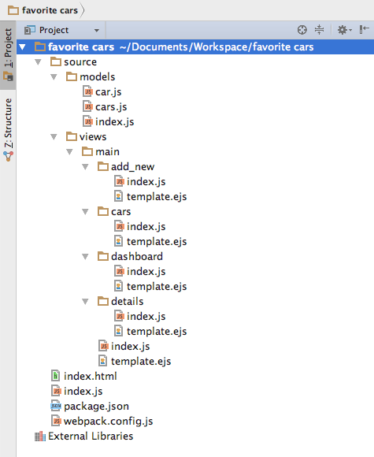

# Introduction

Take the "My Favorite Cars" Tutorial which picks up from where the QuickStart leaves off and builds a simple data-driven app. Simple, yes, but with the essential characteristics we'd expect of a professional application: a sensible project structure, data binding, master/detail, services, dependency injection, navigation, animation, working with 3-rd party labriries and other features.

Для начала мы попробуем рассмотреть флоу приложение которое мы будем писать:

Нам нравиться компонентная архитектура, и **RAD.js** позволяет писать приложение в данном стиле. Именно по этому мы постараемся написать демонстрационное приложение в компонентном стиле.

Как не трудно заметить в данном флоу у нас существует следующие `view`: 

* основной экран, который содержит:
	* меню с переходом на `dashboard` и `cars`
	* контейнер в котором может быть отображены следующие suscreens:
		* `dashboard`
		* `cars`
			* `add new`
		* `details`

Создадим проект с папками для указанных `view` с пустыми файлами `index.js` и `template.js` в каждой, папку для моделей и файлы для них.

Данный проект мы будем собирать как и *Quick Start* с помощью **webpack** и зависимости нам потребуються теже, поэтому [не будем повторяться](../quickstart/Quickstart.md). 

У Вас должно получиться что-то похожее со следующей структурой:

> Обратите внимание что структуру проекта вы можете выбирать по желанию, **RAD.js** не вносит никаких ограничений ни на структуру ни на что либо другое.

## Source

Исходный код этой части, можно скачать по следующей [ссылке](source/1.zip).

## Что дальше?

В [следующей части](mainview.md) мы рассмотри добавление **bootstrap**, как внешней библиотеки и создание `main` view и navigation components.
